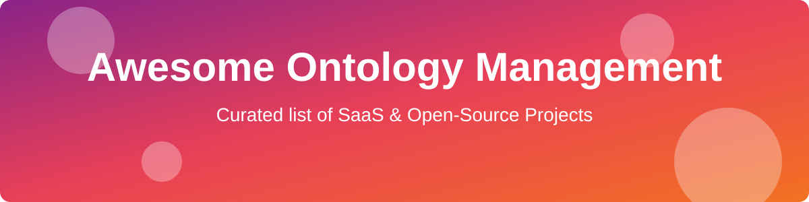

# 🚀 Awesome-Ontology-Management-Platform

  

 

  
  
  

## 🌟 Top Ontology Management Platforms Ecosystem

**Curated List of SaaS Products & Open-Source GitHub Projects**  
*Focused on Ontology Engineering, Knowledge Graphs, Taxonomy Management, Semantic Modeling & Enterprise Data Governance*  

**Last updated: August 2026**

This repository tracks notable **SaaS platforms** and **open-source projects** for **Ontology Management**. These tools enable the creation, editing, governance, versioning, and operationalization of ontologies, taxonomies, thesauri, and knowledge graphs using standards such as OWL, RDF, SKOS, and SHACL for semantic data integration, reasoning, and AI readiness.

**Examples** include TopBraid EDG, PoolParty, Stardog Studio, Metaphactory, GraphDB Workbench, Cambridge Semantics, Data.world Catalog, Enterprise Knowledge Graph solutions, Semantic Arts, and TopQuadrant (the category leaders).

**Open-source emphasis**: This section is heavily expanded with every major active project for ontology editing, RDF frameworks, reasoning, vocabulary management, and open knowledge graph tooling — ideal for semantic web practitioners, knowledge engineers, data governance teams, and researchers building transparent, standards-based ontology systems.

Contributions welcome! Open a PR to add/update entries. Keep descriptions factual and link to official sites.

## 📑 Table of Contents

- [🏢 SaaS/Hosted Platforms](#-saashosted-platforms)
- [💻 Open-Source GitHub Projects](#-open-source-github-projects)
- [🤝 How to Contribute](#-how-to-contribute)
- [⚠️ Disclaimer](#️-disclaimer)
- [📈 Star History](#-star-history)

## 🏢 SaaS/Hosted Platforms

| Platform | Description | Pricing | Free Tier Limit | Company Size / Valuation |
| :--- | :--- | :--- | :--- | :--- |
| **[Cambridge Semantics (Anzo)](https://www.cambridgesemantics.com/)** | Enterprise semantic analytics and knowledge graph platform for data discovery, integration, and ontology-driven insights. | Custom (Contact Sales) | Free Edition (8GB-16GB memory limit) | $3B+ Valuation |
| **[data.world Catalog](https://data.world/)** | Collaborative data catalog and knowledge platform that supports semantic modeling, documentation, and governed data discovery. | Starts at $12/mo (Pro) / ~$90k/yr (Enterprise) | Free Community Tier (3 projects, 100MB/dataset limit) | $1B+ Valuation |
| **[Stardog Studio](https://www.stardog.com/)** | Enterprise knowledge graph platform with ontology-driven data integration, OWL reasoning, virtualization, and analytics for unifying enterprise data. | Custom (Starts ~$50,000/year) | Free Cloud Version (1 million stored edges limit) | $500M+ Valuation |
| **[TopBraid EDG (TopQuadrant)](https://www.topquadrant.com/)** | Enterprise data governance and semantic modeling platform for managing ontologies, taxonomies, knowledge graphs, and reference data with strong governance workflows and SHACL support. | Custom (Contact Sales) | No Free Tier (Enterprise only) | $100M+ Valuation |
| **[GraphDB Workbench (Ontotext)](https://www.ontotext.com/products/graphdb/)** | Semantic graph database with robust ontology management, reasoning, SHACL validation, and visual exploration tools. | Custom / Enterprise | GraphDB Free (Max 2 concurrent database queries) | $50M+ Valuation |
| **[PoolParty](https://www.poolparty.biz/)** | Semantic suite for taxonomy, thesaurus, and ontology management with text mining, linked data capabilities, and automated semantic enrichment. | Starts ~$21,000/yr (Server) / ~$1,900/mo (Cloud) | No Free Tier (Free trials upon request) | $50M+ Valuation |
| **[Metaphactory](https://metaphacts.com/)** | Knowledge graph application platform that uses ontologies to drive modeling, visualization, search, and end-user applications. | Custom / Usage-based via AWS | 14-day Free Trial (No perpetual free tier) | $20M+ Valuation |
| **[Semantic Arts](https://www.semanticarts.com/)** | Specialists in enterprise ontology design and semantic solutions for large-scale data integration and governance. | Consulting engagement | Not Applicable (Consulting Services) | $10M+ Revenue |
| **[Enterprise Knowledge Graph solutions](https://www.enterprise-knowledge.com/)** | Consulting and platform approaches focused on building and operationalizing enterprise knowledge graphs and ontologies. | Consulting engagement | Not Applicable (Consulting Services) | N/A |

## 💻 Open-Source GitHub Projects

- **[Apache Jena](https://github.com/apache/jena)**   
  Comprehensive open-source Java framework for building Semantic Web and Linked Data applications, including RDF, SPARQL, OWL reasoning, and TDB storage.

- **[Protégé](https://github.com/protegeproject/protege)**   
  The leading free, open-source ontology editor supporting OWL 2, with a rich plugin ecosystem, reasoner integration, and decades of community adoption.

- **[Eclipse RDF4J](https://github.com/eclipse/rdf4j)**   
  Modular open-source Java framework for RDF processing, storage, inferencing, SPARQL querying, and SHACL validation.

- **[Wikibase](https://github.com/wikimedia/mediawiki-extensions-Wikibase)**   
  Open-source knowledge base software powering Wikidata, suitable for collaborative structured knowledge and entity management.

- **[OWL API](https://github.com/owlcs/owlapi)**   
  Standard Java API for creating, manipulating, and serializing OWL ontologies, used by many ontology tools and reasoners.

- **[OntoSpark](https://github.com/ontospark/ontospark)**   
  Scalable ontology processing framework built on top of Apache Spark for distributed semantic data integration.

- **[VocBench](https://github.com/art-uniroma2/vocbench3)**   
  Open-source web platform for collaborative management of thesauri, ontologies, and controlled vocabularies (SKOS, OWL), widely used in public sector and multilingual settings.

- **[ROBOT](https://github.com/ontodev/robot)**   
  Command-line tool for ontology release workflows, quality control, reasoning, and automation in OBO and OWL ecosystems.

- **[Ontology Development Kit (ODK)](https://github.com/INCATools/ontology-development-kit)**   
  Toolkit for managing the full ontology lifecycle, continuous integration, and standardized release processes.

- **[WebProtégé](https://github.com/protegeproject/webprotege)**   
  Collaborative, web-based version of Protégé for multi-user ontology development and sharing.

- **[Ontology Access Kit (OAK)](https://github.com/INCATools/ontology-access-kit)**   
  Python library and CLI for working with ontologies, providing unified access across multiple ontology formats and sources.

- **[HermiT](https://github.com/phillord/hermit-reasoner)**   
  High-performance open-source OWL 2 reasoner commonly used with Protégé and OWL API.

- **[Openllet / Pellet](https://github.com/Galigator/openllet)**   
  Open-source OWL 2 DL reasoner for consistency checking, classification, and SPARQL querying over ontologies.

- **[onto-tools](https://github.com/onto-tools/onto-tools)**   
  A modern suite of utilities for semantic data mapping, reasoning workflows, and SHACL validation.

### Additional Strong Open-Source Options

- **Reasoners**: ELK, FaCT++, and other OWL profile-specific open reasoners.
- **SHACL & validation**: TopBraid SHACL API community tools and RDF4J SHACL support.
- **Vocabulary & taxonomy tools**: SKOS editors, iQvoc, and related open thesaurus managers.
- **Graph & RDF stores**: Apache Jena TDB, RDF4J Native Store, and Blazegraph community editions.
- Many domain-specific ontology projects (OBO Foundry tools, BioPortal-related libraries) and Linked Data pipelines.

**Frameworks for building custom systems**: Combine **Protégé / WebProtégé** for authoring, **Apache Jena or Eclipse RDF4J** for storage and SPARQL, open reasoners (Openllet, HermiT, ELK), **ROBOT/ODK** for release pipelines, and **VocBench** for collaborative vocabulary management to create a complete open-source ontology management platform.

## 🤝 How to Contribute

1. Fork the repo.
2. Add/edit entries in `README.md` (follow existing format).
3. Include: name, link, 1–2 sentence description, and whether it's SaaS or open-source.
4. Submit PR with a short explanation.

Star the repo if you find it useful!

## ⚠️ Disclaimer

- This is a **community-curated** list — not exhaustive and not an endorsement.
- Ontology and knowledge graph systems must consider data quality, versioning, provenance, and alignment with organizational governance and privacy requirements.
- Self-hosted open-source solutions require proper expertise in semantic standards, reasoning performance, and long-term maintenance.

## 📈 Star History

<a href="https://www.star-history.com/?repos=ishandutta2007%2FAwesome-Ontology-Management-Platform&type=date&legend=bottom-right">
<picture>
<source media="(prefers-color-scheme: dark)" srcset="https://api.star-history.com/chart?repos=ishandutta2007/Awesome-Ontology-Management-Platform&type=date&theme=dark&legend=bottom-right" />
<source media="(prefers-color-scheme: light)" srcset="https://api.star-history.com/chart?repos=ishandutta2007/Awesome-Ontology-Management-Platform&type=date&legend=bottom-right" />

</picture>
</a>

---

**Made for knowledge engineers, semantic web developers, data governance teams, and ontology practitioners.**  
Let's make ontology management more open, standards-based, and collaborative.
